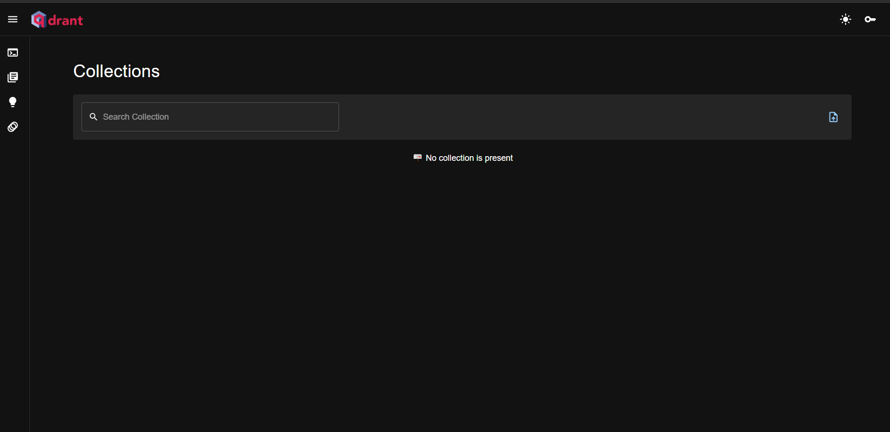
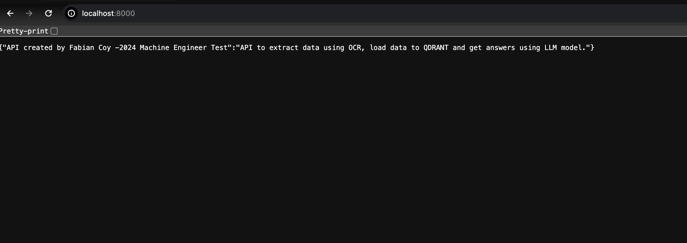
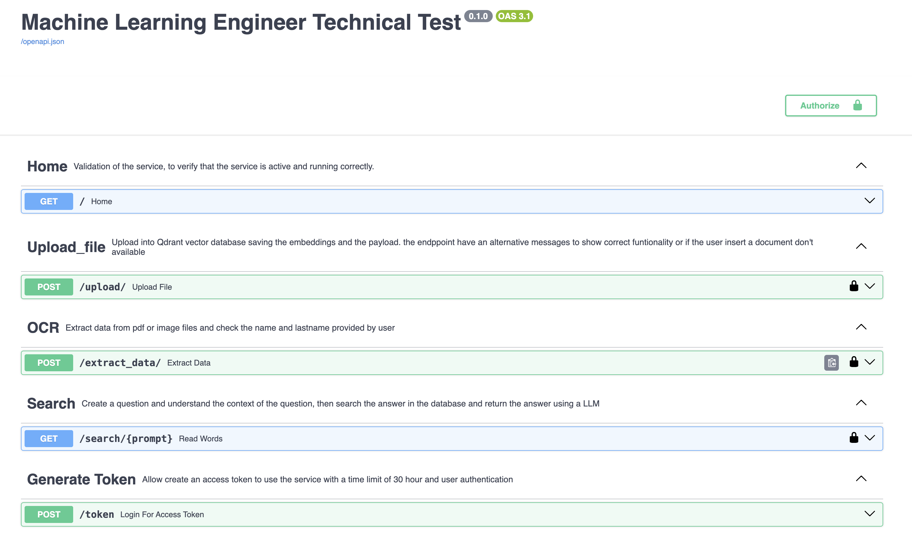
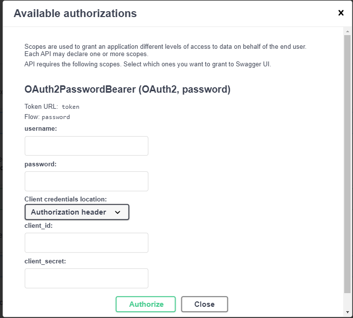
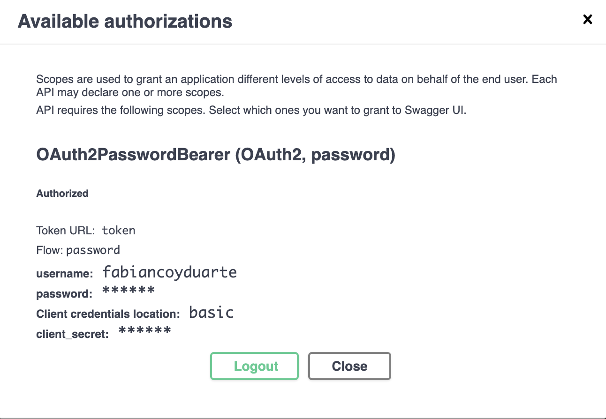
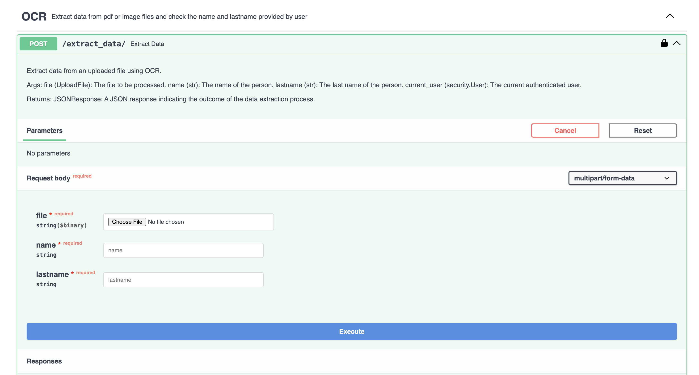
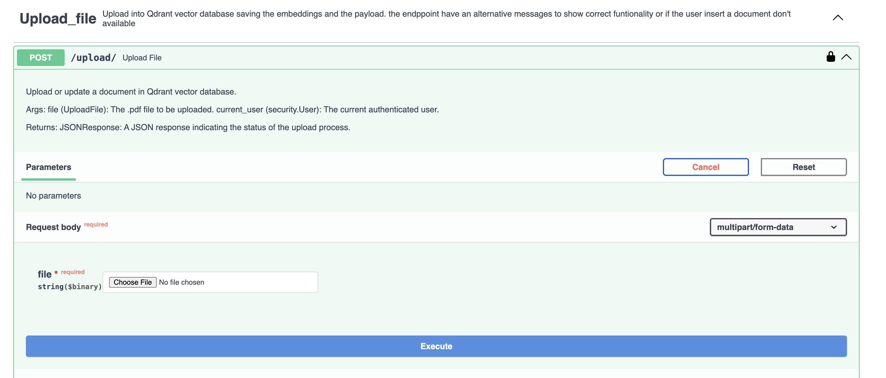
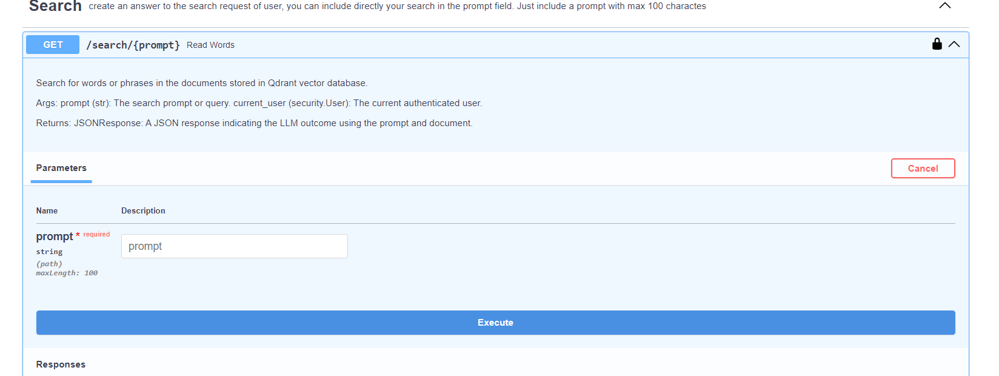

# TE-ML-TechTest

## Task Description: 
The task is to build a system that can extract names and last names from a scanned
PDF document, identify their bounding box locations, and provide an API endpoint to perform fuzzy
matching between the extracted names and the names provided in the request.

Create a Branch and make a pull request to this repository.

## Requirements:

1. Use an open-source OCR library to extract text from the scanned PDF document.
2. Implement a named entity recognition (NER) or a large language model (LLM) approach to
identify and extract names and last names from the extracted text.
3. Parse the extracted text and OCR results to find the bounding box coordinates of the identified
names and last names.
4. Create a RESTful API using FastAPI or Flask that accepts a scanned PDF file and a set of
name-last name pairs as input.
5. Perform fuzzy matching (with a similarity threshold of 90%) between the extracted names and
the provided names in the API request.
6. Return the extracted names, their bounding box coordinates, and the fuzzy matching results as a
JSON response.
7. Implement a vector database (e.g., Chroma, Qdrant) to store the extracted text from the PDF
documents.
8. Use an open-source embedding model (e.g., Sentence-BERT, Universal Sentence Encoder) to
convert the extracted text into vector representations and store them in the vector database.
9. Create another RESTful API endpoint that accepts a question as input and returns an answer
based on the RAG strategy.
10.Create a Docker container image for the entire application, including the text extraction, named
entity recognition, bounding box parsing, vector database, and RAG components. Ensure that
the container can be built and run using Docker commands or a Docker Compose file. Include
instructions for running the containerized application and accessing the API endpoints.
Test Steps:
1. Set up the Development Environment:
• Create a new Python virtual environment and install the required libraries (e.g.,
PyMuPDF, Tesseract OCR, spaCy, Hugging Face Transformers, FastAPI or Flask).
• Obtain a sample scanned PDF document containing names and last names for testing
purposes.
2. Implement Text Extraction from PDF:
• Use PyMuPDF or a similar library to extract text from the scanned PDF document.
• Optionally, you can preprocess the extracted text (e.g., remove newlines, clean up
formatting) for better NER or LLM performance.
3. Implement Named Entity Recognition (NER) or LLM Approach:
• Use spaCy's pre-trained NER model or a custom NER model trained on a relevant
dataset to identify names and last names in the extracted text.
• Alternatively, use a pre-trained NER (e.g., BERT, RoBERTa) from the Hugging Face
Transformers library for the named entity recognition task. It is easier to use a
Generative LLM for zero-shot NER and return the response as an usable JSON.
4. Parse Bounding Box Coordinates:
• Integrate the OCR library (e.g., Tesseract OCR) to obtain the bounding box coordinates
of the recognized words in the PDF document.
• Match the extracted names and last names with their corresponding bounding box
coordinates from the OCR results.
5. Implement the RESTful API:
• Use FastAPI or Flask to create a RESTful API endpoint that accepts a scanned PDF file
and a set of name-last name pairs as input.
• Perform the text extraction, named entity recognition, and bounding box parsing steps
on the uploaded PDF file.
• Implement fuzzy matching (e.g., using the python-fuzzy library) between the extracted
names and the provided names in the API request, with a similarity threshold of 90%.
• Return the extracted names, their bounding box coordinates, and the fuzzy matching
results as a JSON response.
6. Set up a Vector Database:
• Choose and install an open-source vector database solution (e.g., Chroma, Qdrant,
Milvus) compatible with your development environment. If you are using a docker
image of an open-source database, make sure to include it in the docker compose file.
• Create a new database or collection within the vector database to store the extracted text
from the PDF documents.
7. Implement Text Embedding:
• Use an open-source embedding model like Sentence-BERT or Universal Sentence
Encoder to convert the extracted text into vector representations.
• Integrate the embedding model with the vector database to store the text embeddings
along with their corresponding text snippets.
8. Implement Retrieval-Augmented Generation (RAG):
• Create a new RESTful API endpoint that accepts a question as input.
• Implement the RAG strategy to retrieve relevant text snippets from the vector database
based on the similarity between the question embedding and the stored text embeddings.
• Use a pre-trained language model (e.g., GPT-3.5, Gemini) to generate an answer based
on the retrieved text snippets and the input question.
• Return the generated answer as the response to the API request.
9. Containerization:
• Create a new Dockerfile in the project directory with all the required dependencies to
run the API server.
• If required, generate a docker-compose file.
10.Documentation and Submission:
• Document the code, and any external libraries or resources used.
• Provide instructions for setting up and running the system, as well as any additional
dependencies or requirements.


# SOLUTION 
## Project Description

This project aims to develop a AI solutions to extract data from pdf files using OCR and create a RAG that provides their functionalities through REST endpoints.

## Funtionality 1: OCR and similarity between name and last name inserted by user

Develop an endpoint that allows the upload of .pdf and .png documents. The endpoint should process the uploaded documents and extract data to compare the extracted names and last names. The response should be structured according to the requirements to provide the correct response.

## Functionality 2: Document Processing and Storage (.pdf)

Develop an endpoint that allows the upload of .pdf documents. Utilize an Encoder to convert the extracted text into vector representations, to process these documents and generate vector embeddings of the textual content. Store these embeddings in a vector database.

## Functionality 3: Information Retrieval and Search

Implement an endpoint that enables text search in the vector database. Retrieve the most relevant documents based on the similarity of their embeddings. Use these documents to respond to user queries or questions sent to the endpoint.

## Development

The development of this project involves implementing an API with the three main functionalities described in the project description. The API should provide endpoints for data extraction of a PDF using OCR, document processing and storage, as well as information retrieval and search.

Applying good practices in API development and ensure security, the API is developed using FastAPI, which includes built-in security features. These features can be configured to authenticate and authorize users accessing the API endpoints. These option ensure options to deploy in production easily and have safe data integrity.

During development, it is recommended to run the API on a local machine for testing and debugging purposes or just to improve more exception, create a unit test or create new features. You will be able to run locally the API and make some changes to adapt in your environment and use it successfully. 

For production deployment, it is recommended to use Docker file or the  Docker Compose file located in this repository. Docker compose file allows for containerization of the API and Qdrant, the vector database used for storing the embeddings. If you run the Docker Compose, you must guarantee that the vector database is able to be connected with other components. Also, in config.yaml be sure of have the correct connection.

To deploy the project in production, you can create a Docker Compose file that includes the necessary configurations for the API and Qdrant. This file can be used to spin up the containers and ensure that the solution runs correctly in a production environment.

Please note that the above description provides a high-level overview of the development and deployment process. Further details and specific implementation steps may be required based on the project requirements and infrastructure setup.


## Main Resources Used

- Qdrant: A vector database used for storing the embeddings.
- FastAPI: A framework used for building the API.
- OpenAI API: Used for generating vector embeddings of the document content.
- Langchain: A framework used to connect a Language Model (LLM) for processing text and producing accurate answers.
- Tesseract-OCR: optical character recognition engine for various operating systems.

## Qdrant Installation

To install Qdrant, follow these steps:

1. Download the official Qdrant image from [https://qdrant.tech/documentation/quick-start/](https://qdrant.tech/documentation/quick-start/).
2. Run the following command to pull the image:
        ```
        docker pull qdrant/qdrant
        ```
3. Start the container using the following command:
        ```
        docker run -p 6333:6333 -p 6334:6334 qdrant/qdrant
        ```

Please note that the above steps assume you have Docker installed on your system.

When you guarantee and proof that Qdrant is running correctly, you will be able to access to the next url http://127.0.0.1:6333/dashboard and manipulate Qdrant tool and explore its functionalities. 

The next image show the correct deployment is running:



## Deploy API

To deploy the API, follow these steps:

1. Create your own virtual environment in your local machine.
2. Install the requirements located in the `requirements.txt` file using the following command:
        ```
        pip install -r requirements.txt
        ```
3. Create a `config.yaml` file that includes all the credentials to be connected with all components. The structure and type of the variables should be as follows:

        ```yaml
        openai:
            key: string
            model: string
            tokenizer: string
            llm_model: string
        qdrant:
            host: string
            port: int
            collection: string
            size_embeddings: int
        llm:
            threshold: int
            prompt_template: string
            prompt_template_1: string
            prompt_template_RAG: string
        secure:
            SECRET_KEY: string
            ALGORITHM: string
            ACCESS_TOKEN_EXPIRE_MINUTES: int
            PASSWORD: string
        api:
            max_length_prompt: int
        ```

4. Make sure to replace the `string` and `int` values with the actual credentials and configuration values.

The `config.yaml` file is structured into five sections:

1- OPENAI: In this section, you are required to create an API key using your personal or organizational account on the OpenAI platform. Additionally, you must specify the model responsible for generating embeddings, the tokenizer used for token counting in your text, and the LLM (Language Model) model integrated with the Langchain framework, which will generate the desired outcomes.

2- Qdrant: This section configures the vector database, Qdrant. Here, you define the host and port where Qdrant is running. The parameter collection specifies the name under which documents will be saved. If the collection does not exist, the script can automatically create it. The size_embeddings parameter determines the dimensionality of the embeddings, which can significantly enhance user searches and organize text logically.

3- LLM: In this segment, you set the parameters for the Language Model (LLM). The threshold parameter establishes a limit based on the similarity between search queries and documents. If the similarity falls below this threshold, the system will return a message indicating that the indexed data does not match the search. The prompt_template, prompt_template_1 and prompt_template_RAG define the instruction for the LLM model's operation. You can customize this instruction by specifying the tone, role, and structure to formulate an appropriate response.

4- SECURE: This section is dedicated to configuring the security module. The SECRET_KEY parameter is used for authenticating the primary user to generate other hashed passwords. ALGORITHM specifies the type of hashing algorithm employed. ACCESS_TOKEN_EXPIRE_MINUTES determines the duration, in minutes, for which a logged-in user can utilize the API. Lastly, PASSWORD is a parameter used for accessing the unsecured module.

5- api: This section includes parameters related to the API. max_length_prompt_int sets the maximum number of characters to be inserted in the user prompt.

Once the environment is set up and the credentials are configured, you can deploy the API using the appropriate deployment method, such as running in local,  Docker Compose or any other deployment tool of your choice.

You will have just the Qdrant setup to run with a docker-compose configuration, the parameters of LLM, SECURE Module and API setup. The only value and import string value es with OPENAI KEY that you should provide according your enterprise or personal account.

# Create a User 
Before to run the API follow the next steps:

"To create a user, follow these steps:"

1-Locate the script named create_user.py within the lib directory of the repository.

2-Run the script by executing it with your preferred Python interpreter.

3-Follow the instructions provided by the script. You will be prompted to enter a username and password.

4-Remember the username and password you've entered, as they will be required when interacting with the deployed API.

# Start API locally

To deploy an API using FastAPI, follow these steps:

To run your FastAPI application, execute the following command in your terminal:

        ```
        uvicorn main:app --host 0.0.0.0 --port 8000
        ```

- `main:app` specifies the location of your FastAPI application.
- `--host 0.0.0.0` ensures that the server is accessible from external devices.
- `--port 8000` specifies the port number on which the API will run. Change this port number if necessary.

**Access Your API:**
Once the API is running, you can access it using the following URL in your web browser or API client:

    ```
    https://localhost:8000
    ```

Replace localhost with the appropriate hostname or IP address if the server is hosted elsewhere.

**Interact with Endpoints:**
With the API running, you can now interact with its endpoints using HTTP requests. Use tools like cURL, Postman, or your preferred programming language's HTTP library to send requests and receive responses.

Stop the Server:
To stop the API server, you can press **Ctrl + C** in the terminal where it's running. This will gracefully shut down the server.

When you have your API running correctly will have the next outcome in your browser: 



# Interaction and check functionality
Once the API is running, you can easily interact with it by accessing the Swagger documentation. Open your web browser and navigate to:

    ```
    https://localhost:8000/docs
    ```

This interactive documentation provides a user-friendly interface to explore and test the API's functionalities.

Functionalities:
The API offers the following functionalities:

-**Home:** A GET response endpoint to check the functionality of the API.
-**OCR:** A POST response endpoint for processing pdf or image documents to extract name and last name
-**Upload File:** A POST response endpoint responsible for uploading a new file by adding text and embeddings in Qdrant.
-**Search:** A GET response endpoint designed to provide answers based on user questions.
-**Generate Token:** A POST response endpoint used to create a respective token by inserting a username and password.

With the API running and the documentation open, you can easily interact with each endpoint by clicking on them and providing the required parameters. Use the provided examples to understand the expected input and output formats.

Next image represent the visualization API documentation



Before utilizing the Upload File or Search functionalities, authentication within the API is required. This occurs when you input your respective credentials in the authentication option, situated in the upper-right corner of the screen, highlighted in green. The subsequent image illustrates how the new screen appears when accessed.



Once you possess the correct credentials and have obtained a token, you will be directed to the following screen, as depicted in the accompanying image.



To use the OCR endpoint, click on the `Try Out` button. Then, you have three options that the user must fill in: the file option, where you upload your file, and the name and last name fields that you want to compare with the extracted data. You will be able to get the correct answer if the name and last name have a similarity of more than 90% with the extracted structure, bounding boxes where they are located, and the similarity between them. 

The image below specify where is the endpoint located in the deployment. 



To be more explicit with the correct answer the next json file show an example: 

```
{
  "Name_extracted": "DEREK",
  "last_name_extracted": "THOMAS",
  "Bounding_boxes_name": [
    [
      "0",
      "539",
      "0",
      "551",
      "0"
    ],
    [
      "0",
      "539",
      "0",
      "551",
      "0"
    ],
    [
      "0",
      "539",
      "0",
      "551",
      "0"
    ],
    [
      "0",
      "539",
      "0",
      "551",
      "0"
    ],
    [
      "0",
      "539",
      "0",
      "551",
      "0"
    ]
  ],
  "Bounding_boxes_last_name": [
    [
      "0",
      "539",
      "0",
      "551",
      "0"
    ],
    [
      "0",
      "539",
      "0",
      "551",
      "0"
    ],
    [
      "0",
      "539",
      "0",
      "552",
      "0"
    ],
    [
      "0",
      "539",
      "0",
      "551",
      "0"
    ],
    [
      "0",
      "539",
      "0",
      "551",
      "0"
    ],
    [
      "0",
      "538",
      "0",
      "552",
      "0"
    ]
  ],
  "fuzzy_matching_name": 100,
  "fuzzy_matching_lastname": 100
}
```

To engage with the Upload File option, click on the `Try Out` button. Subsequently, you will encounter one fields. The field allows you to upload a file to Qdrant. If the file has a different extension other than .pdf, the API will respond with `Invalid file type. Please upload a .pdf file`.

For enhanced clarity and streamlined interaction with other systems, the API provides detailed explanations of the processes involved in the upload or update procedures. The interface displayed in the following image illustrates these two fields available for interaction.



To utilize the Search option, begin by selecting the `Try Out` button. Subsequently, you can input your desired text into the prompt field, which corresponds to the user's search query. Afterward, click on `Execute`, and the API will provide a response message. However, if the question or prompt fails to meet the similarity score criteria, the API will respond with: `I don't have any data matching a document according to your search.`

The next image represents the visualization of Search




Once you have verified the proper functionality of the API and ensured successful document updates in the Qdrant vector database, you can proceed to run your project using Docker Compose. This allows for the creation of multiple containers, with one designated for the API and another for the pre-downloaded Qdrant image.

To deploy the project, execute the following terminal command:

    ```
    docker-compose up -d
    ```
This command initiates the deployment in detached mode, allowing the containers to operate independently in the background.

Ensure that the configuration settings in your Docker Compose file enable Qdrant to establish connections with other containers as required. This facilitates seamless interaction between components within your infrastructure.

By default, when you deploy the application locally, you can access both services at the following URLs: 
- The API deployment can be accessed at `localhost:8000`.
- The Qdrant service can be accessed at `localhost:63333`.
Please note that these URLs are the default configurations and may vary depending on your specific setup.

# Next Improvements 
This solution allows you to extract data from images and compare it with specific words in the name and last name. The solution is capable of applying rotation to extract and retrieve data, providing useful outcomes. However, to have a complete solution, it is necessary to consider different parameters such as format, angle, and general variations, as they can significantly impact performance. Although the solution has been tested with two driver's licenses and is currently working correctly, it is important to thoroughly test and validate its performance with various formats and scenarios.

This is the first step in building your own RAG (Retriever, Answer Generator) customized for your specific set of documents. However, it is crucial to conduct experiments with different file types and adjust their lengths to evaluate the effectiveness of search functionalities when generating embeddings based on specific sizes. Sometimes, it is beneficial to explore alternative approaches, such as modifying chunk sizes for storage in the vector database. For this development, a chunk size of 500 tokens is implemented as the primary strategy to handle any document. While an open-source embedding model should be used ideally, due to time constraints, an alternative approach using the OPENAI service to generate embeddings was implemented. Additionally, to enhance the performance of the Language Model (LLM), strategies like k-shot or CoT can be implemented with prompts to achieve specific solutions.

Finally, consider employing an unsupervised machine learning model to preprocess the inception of your documents and generate labels, streamlining the process for the Language Model (LLM) while enhancing the provision of comprehensive information.